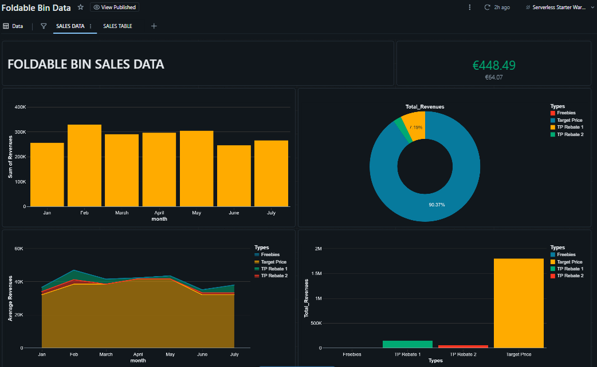
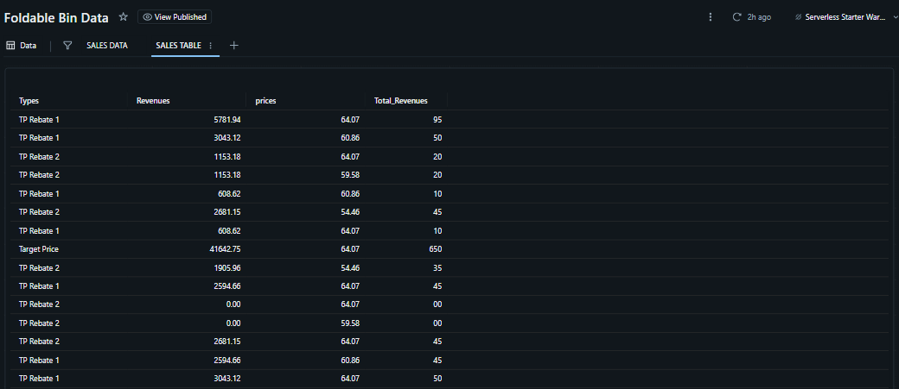
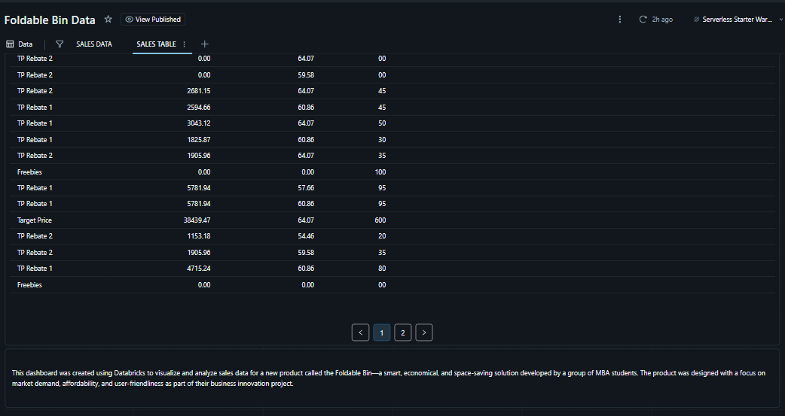

# Foldable_Bin
# Foldable Bin Project 📦

This repository contains the documentation for an MBA student project – a foldable, user-friendly, and highly marketable waste bin.

## 📌 Overview
- Purpose: Develop a low-cost, high-demand product
- Product: Foldable smart bin with ergonomic design

## 📈 Dashboard
We used Databricks to visualize user data and market potential.

- [SQL QUERIES](Sql_Queries.md)

